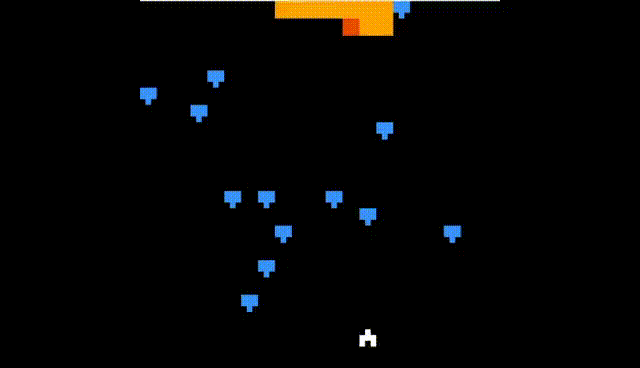

# Centipede

## Introduction

This is a centipede game created in MIPS Assembly.
The program uses two custom grid systems (coded from scratch) to display objects: object grid and display grid.
An excel file to provide some visualization is included in the `grid/` folder.



## Running the Program

### Step 1

Open `centipede.s` in MARS Simulator.

### Step 2

Go to Tools -> BitMap Display and choose **"Connect to MIPS"**.

### Step 3

Go to Tools -> Keyboard and Display MMIO Simulator, and configure the following:

```
# Bitmap Display Configuration:
# - Unit width in pixels: 4
# - Unit height in pixels: 4
# - Display width in pixels: 256
# - Display height in pixels: 256
# - Base Address for Display: 0x10008000 ($gp)
```

Click **"Connect to MIPS"**.

### Step 4

Assemble the program, then click run.

### Step 5

Play the game by typing into the **Keyboard and Display MMIO Simulator** and seeing the game in **"BitMap Display"**.
Use "w", "s", "a", "d" to go up, down, left, right, respectively.
Use the key "j" to shoot darts. To prevent mis-press of keys, the restart ("r") and quit ("q") keys are only activated when the game is over (i.e., will only work on game over screen).

## Final Words

Enjoy!
